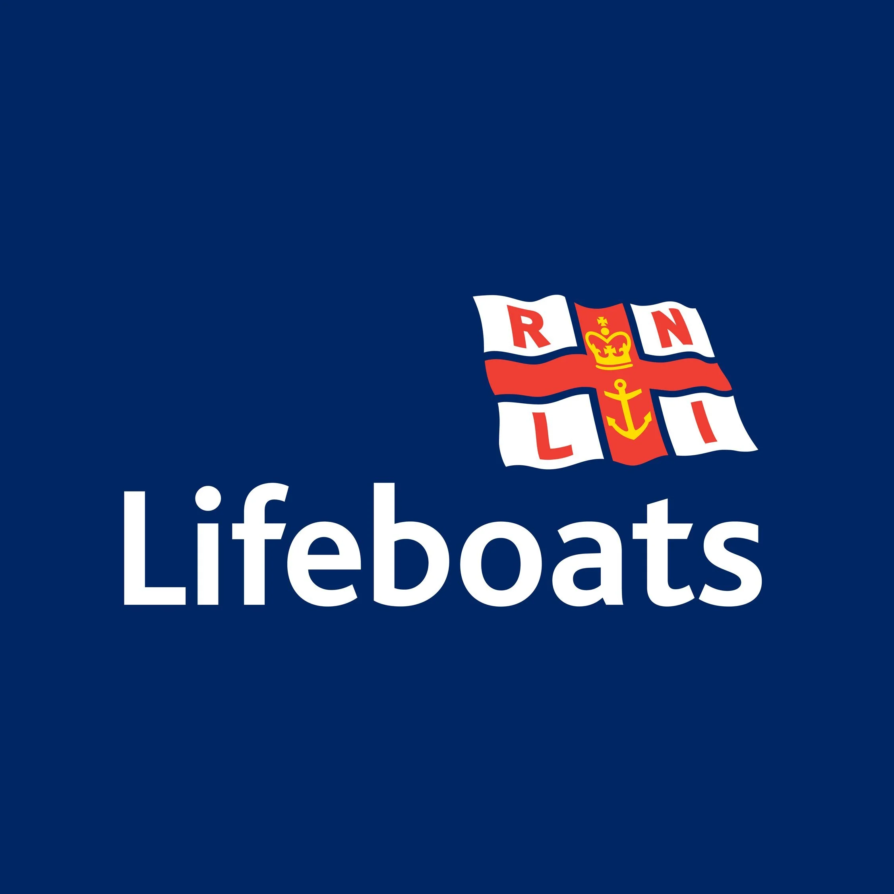

# RNLI Lifeboat Launches

A Home Assistant integration that gives you information about the most recent
[RNLI](https://rnli.org) lifeboat launches from a station of your choice.

It creates a sensor whose state is the timestamp of the station's latest
launch, with details of the launch (lifeboat ID, station website, etc.) as
attributes. Data comes from the public RNLI launches feed and is refreshed
every 5 minutes.

> ❤️ **Enjoying this integration?** The RNLI is a charity that saves lives at
> sea, funded almost entirely by voluntary donations. If this is useful to you,
> please consider giving something back to the volunteers whose work makes the
> data possible: **[Donate to the RNLI »](https://rnli.org/support-us/give-money/donate)**

## Installation

### HACS (recommended)

1. In HACS, add this repository (`Blucose/RNLI_HACS`) as a custom repository
   of type **Integration**.
2. Install **RNLI Lifeboat Launches**.
3. Restart Home Assistant.

### Manual

1. Copy the `custom_components/rnli_launches` folder into your Home Assistant
   `config/custom_components/` directory.
2. Restart Home Assistant.

## Setup

1. Go to **Settings → Devices & Services → Add Integration**.
2. Search for **RNLI Lifeboat Launches**.
3. Pick your lifeboat station from the dropdown. All 238 RNLI stations are
   listed (sourced from RNLI open data, with names refreshed from the live
   launches feed), sorted by distance from your Home Assistant home location
   so your nearest station appears first. You can also type a name manually.

You can add the integration multiple times to monitor several stations.

## Sensor

Each configured station gets a sensor like `sensor.rnli_tower_latest_launch`:

- **State** — timestamp of the most recent launch (or unknown if the station
  has no launches in the recent feed).
- **Attributes** — `lifeboat_id`, `station_title`, `station_website`,
  `launch_id`, `recent_launch_count`, and any other fields the feed provides.
  Known stations also get `latitude`/`longitude` (so the sensor appears at
  the station's location on the Home Assistant map), `station_url`,
  `what3words`, and `station_type` (ALB/ILB) from RNLI open data.

## Example automation

```yaml
automation:
  - alias: Notify on lifeboat launch
    trigger:
      - platform: state
        entity_id: sensor.rnli_tower_latest_launch
    action:
      - service: notify.mobile_app_your_phone
        data:
          title: "Lifeboat launched!"
          message: >
            {{ state_attr('sensor.rnli_tower_latest_launch', 'station_title') }}
            launched lifeboat
            {{ state_attr('sensor.rnli_tower_latest_launch', 'lifeboat_id') }}
```

## Support the RNLI

Every launch this integration reports is a crew of volunteers heading out to
help someone in trouble. The RNLI relies on donations to keep those lifeboats
crewed, fuelled, and ready — around the clock, all year round.

If you like this integration, the best thank-you isn't to me — it's to them:

### 👉 [Donate to the RNLI](https://rnli.org/support-us/give-money/donate)

Every little helps keep a lifeboat afloat. ⛑️🌊

---

<sub>The RNLI name and logo are trademarks of the Royal National Lifeboat
Institution (RNLI) and are used here with the RNLI's permission. This is an
independent, community-built integration and is not officially endorsed by or
affiliated with the RNLI. See [LOGO_LICENSE.md](LOGO_LICENSE.md).</sub>
